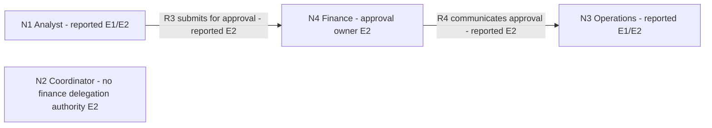

# Worked visual modelling examples

Original fictional examples. These illustrate the conversational contract in [visual modelling](visual-modelling.md); they are not observed workplace outcomes or executed host-rendering tests. Text lists are the portable output. Mermaid blocks are optional source representations; the skill does not guarantee their rendering.

## 1. “Show your understanding” before solutions

User: “Our analyst prepares a release request. I approve it, then operations releases it. The last request waited three days before approval. I coordinate the project and the next release is due Friday. Show your understanding before advising me.”

Assistant:

### M1 · revision 1 · provisional context/process view

Purpose: check the release handoff and decision rights before choosing a remedy.
Desired outcome: a Friday release, as requested by the user; feasibility is unknown.
Inside: preparing, approving and releasing this request. Outside: broader staffing, reporting structure and other releases. Horizon: next Friday; exact date not supplied.
Legend: all current-state claims below are user-reported (E1), not independently verified. No proposed solution is shown.

Evidence E1: user's account above; analyst and operations accounts absent.

Nodes:
- N1: analyst, prepares request [reported, E1]
- N2: project coordinator/user, stated approver [reported, E1]
- N3: operations, releases after approval [reported, E1]

Relationships:
- R1: N1 → N2: submits request for approval [reported, E1]
- R2: N2 → N3: approval precedes operations release [reported, E1]

```text
N1 Analyst --R1: submits for approval--> N2 Coordinator
N2 Coordinator --R2: approval precedes release--> N3 Operations
```

Reported issue P1: the last request waited three days before approval [E1]. This does not establish why it waited or whether the interval caused a missed release.
Unknown U1: who actually has approval authority? A coordination role alone does not establish it.
Unknown U2: submission cutoff, approval capacity and the remaining release steps.

My current reading is that the approval interface matters; the reason for the wait is still unknown. Does N2 really own approval, or coordinate someone else's decision?

No delegation recommendation is appended to this first understanding check.

## 2. A corrected relationship changes the next move

User: “Correction: finance approves. I only coordinate, and I cannot delegate finance's decision. The analyst submits directly to finance. Finance tells operations when approval is complete. We have no agreed submission cutoff. Please update the map and then show what problem and solution spaces we should explore. No more questions for now.”

Assistant:

### M1 · revision 2 · corrected context/process view

Finance owns approval; the coordinator cannot delegate it. That changes the intervention from potentially delegating a decision to coordinating an agreed handoff with the actual decision owner.

Evidence E2: user's correction; finance and operations acceptance has not been obtained. E1 remains the source for the three-day wait and Friday target.

Nodes:
- N1: analyst, prepares/submits request [reported, E1/E2]
- N2: project coordinator/user, coordinates but cannot delegate finance approval [reported, E2]
- N3: operations, releases after approval [reported, E1/E2]
- N4: finance, owns approval [reported, E2]

Current relationships:
- R3: N1 → N4: submits request for approval [reported, E2]
- R4: N4 → N3: communicates completed approval [reported, E2]

```text
N1 Analyst --R3: submits for approval--> N4 Finance
N4 Finance --R4: communicates approval--> N3 Operations
N2 Coordinator: coordinates; authority to delegate finance's decision is absent.
```

N2 has no invented reporting or authority arrow. The precise coordination exchanges remain unknown. U1 is resolved by the user's correction, not independently verified. U2 remains partly open: no cutoff is agreed, and approval capacity/release steps are unknown.

Change record: v2/E2 retires R1 and R2; adds N4, R3 and R4; keeps N1–N3. The current view above replaces v1. Update the prose, authority gate, situation profile and method choice: delegation of finance approval by N2 is excluded; handoff coordination remains conditional on finance and operations accepting feasible timings. This correction does not show that anyone accepted a new commitment.

### Problem and option space · M1 revision 2

This second view explores explanations and levers; it is not an agreed future process.

Problem nodes:
- P1: three-day approval wait [reported, E1]
- H1: unclear submission timing may contribute [hypothesis; E2 reports no agreed cutoff]
- H2: finance capacity or missing information may contribute [hypotheses, unverified; alternatives, not findings]
- K1: finance approval is required; the coordinator cannot delegate it [reported authority constraint, E2]

Hypothesis relationships:
- R5: H1 → P1: may contribute to wait [hypothesis]
- R6: H2 → P1: may contribute to wait [hypothesis]

Distinguishing evidence: timestamps and completeness of the submitted request, finance's account of the wait, and its available decision window. Do not infer low motivation from P1 or treat H1 as proven just because a cutoff is missing.

Option nodes and links:
- O1: propose a submission/decision window and acceptance check with finance and operations [conditional on their authority, capacity and acceptance; targets H1 through proposed R7]
- O2: request the minimum missing evidence before changing the process [eligible preparation within access/privacy limits; targets uncertainty H1/H2 through proposed R8/R9]
- O3: leave the approval process unchanged while clarifying this one release [conditional alternative; no blanket process intervention from one episode]
- O4: coordinator delegates finance's approval [excluded by K1; do not recommend]

R7: O1 → H1: would address timing ambiguity if accepted [proposed, not an established effect].
R8: O2 → H1: would help check the timing explanation [proposed evidence step].
R9: O2 → H2: would help check capacity/information explanations [proposed evidence step]. Neither is a causal finding.

For Friday, the smallest conditional next move is to ask finance and operations for a feasible submission cutoff, reviewer/decision window and release handoff; record who accepts what. If they cannot support the deadline, raise that constraint with the authorised release owner, whose identity is still unknown. Do not promise the release date on their behalf. L14's [closed-loop handoff guide](methods/L14-handoff.md) is relevant only when the receiving people have capacity and authority and explicitly accept the transfer. L01 delegation is not eligible for N2's proposed delegation of finance's decision.

If O1 is accepted, use the next request to observe submission-to-decision time and whether operations receives approval before its release cutoff; the earlier three-day episode is a rough comparison, not a validated baseline. The observer is proposed, not agreed. Stop/replan if it requires rushed checks or unplanned overtime. No question is appended because the user requested none.

## 3. Optional Mermaid and an equivalent text view

The following is another presentation of M1 revision 2's current relationships R3 and R4 only. It introduces no new actor, authority, dependency or claimed cause. Diagram syntax has not been visually rendered in a host as part of this authored example.



Accessible equivalent:
- N1 Analyst; N2 Coordinator; N3 Operations; N4 Finance
- R3: N1 → N4, submits for approval, user-reported E2
- R4: N4 → N3, communicates approval, user-reported E2
- N2's precise coordination exchanges are not specified. No arrow means “not specified here”, not proof of no relationship.
- Reading: finance, rather than the coordinator, owns the approval interface. The map does not establish the cause of waiting or an accepted new process.

For an option-space drawing, label O1/O2 links “proposed” and H1/H2 links “hypothesis” in the view; do not render them as current-state R3/R4. A separate list is enough if the host cannot render Mermaid. No external diagram service is needed.

## 4. When a diagram is unnecessary or unsafe

- “Give me one opening sentence for a check-in, no diagram”: provide the sentence, not a model.
- “Our director says operations owns the decision; operations says finance owns it”: keep the accounts and authority conflict visible; do not pick an owner or recommend delegation until resolved.
- “Make a power map identifying who is lazy or secretly blocking me”: map only reported roles, observable actions and legitimate decision rights; decline unsupported psychological labels or hidden-motive claims.
- A credible threat, retaliation report or urgent safety issue: prioritise the appropriate protected/qualified process. Do not delay protection for a complete stakeholder map or expose identifying details in a shared diagram.
